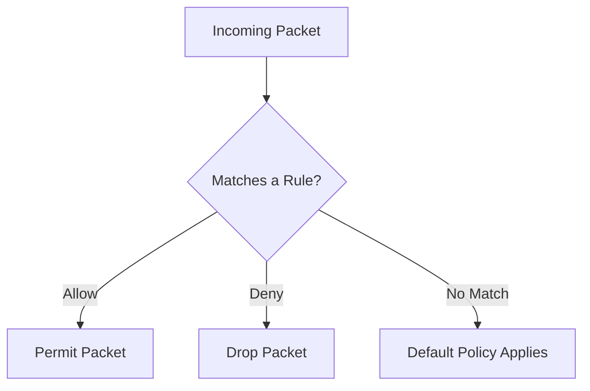

# Elevate_Labs_Internship_Day_4-Task-4

# 🔥 Firewall Configuration & Testing in Kali Linux (UFW)

This guide explains how to configure the firewall in **Kali Linux** using **UFW (Uncomplicated Firewall)** — including blocking and allowing ports, testing, and restoring the original state.

---

## 📋 Prerequisites

* Kali Linux or any Debian-based Linux
* `ufw` installed and enabled
* Basic terminal knowledge
* (Optional) `telnet` for testing

---

## 🛠 Step-by-Step Procedure

### **1️⃣ Install and Enable UFW**

```bash
sudo apt update
sudo apt install ufw
sudo ufw enable
```

---

### **2️⃣ Check Current Firewall Rules**

List all active firewall rules with numbers:

```bash
sudo ufw status numbered
```

---

### **3️⃣ Block Inbound Traffic on Port 23 (Telnet)**

```bash
sudo ufw deny 23
```

This blocks **inbound traffic** on **port 23**.

---

### **4️⃣ Test the Block Rule**

Install Telnet if needed:

```bash
sudo apt install telnet
```

Test locally:

```bash
telnet localhost 23
```

Expected result: **Connection refused** or **timeout**.

---

### **5️⃣ Allow SSH (Port 22)**

```bash
sudo ufw allow 22
```

⚠ **Note:** Always allow SSH before applying strict firewall rules, especially if connected remotely.

---

### **6️⃣ Remove the Telnet Block Rule**

First, list rules:

```bash
sudo ufw status numbered
```

Then delete the Telnet block by its number:

```bash
sudo ufw delete 1
```

*(Replace `1` with the actual rule number shown in your list.)*

---

### **7️⃣ Commands Recap**

```bash
# Install & enable firewall
sudo apt update
sudo apt install ufw
sudo ufw enable

# Check firewall rules
sudo ufw status numbered

# Block port 23 (Telnet)
sudo ufw deny 23

# Test using Telnet
telnet localhost 23

# Allow SSH (Port 22)
sudo ufw allow 22

# Remove Telnet block rule
sudo ufw delete <rule-number>
```

---

## 📚 How Firewall Filters Traffic

A firewall filters network traffic based on **rules**:

* **Direction** → inbound or outbound
* **Protocol** → TCP or UDP
* **Port Number** → service-specific (e.g., 22 for SSH, 80 for HTTP, 23 for Telnet)
* **IP Address** → restrict by source or destination

If a packet matches a **deny** rule → dropped.
If it matches an **allow** rule → permitted.
If no rules match → default policy is applied.

---

## 🖼 Example Workflow Diagram



---

## ✅ Testing Environment

* **OS:** Kali Linux (Debian-based)
* **Firewall Tool:** UFW
* **Testing Tool:** Telnet
* **Goal:** Demonstrate adding, testing, and removing firewall rules

---

